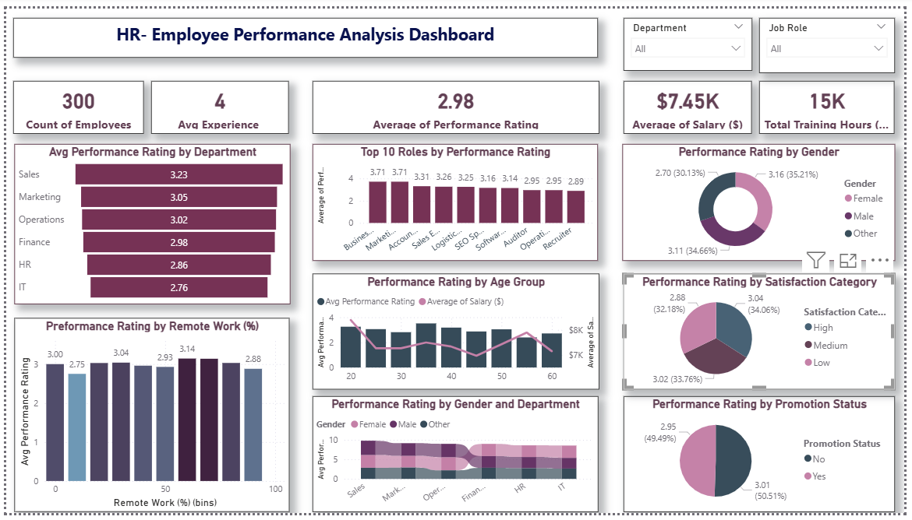

# HR - Employee Performance Analysis Dashboard

## Overview

This project is an interactive **HR Employee Performance Analysis Dashboard** built in **Power BI**. It analyzes the performance, compensation, satisfaction, and demographic patterns of 300 employees across multiple departments, roles, and office locations — helping HR teams and management make data-driven decisions around promotions, training, and workforce planning.

---

## Project Files

| File | Description |
|------|-------------|
| `Employee performance analysis.pbix` | Power BI dashboard file with all visuals and data model |
| `HR_Employee_Performance_Dataset.xlsx` | Source dataset containing employee records |
| `Employee_performance_analysis.png` | Screenshot preview of the dashboard |

---

## Dataset

**File:** `HR_Employee_Performance_Dataset.xlsx`

The dataset contains **300 employee records** with the following columns:

| Column | Description |
|--------|-------------|
| Employee ID | Unique identifier for each employee |
| Employee Name | Name of the employee |
| Department | Department (Sales, IT, HR, Finance, Marketing, Operations) |
| Job Role | Specific role within the department |
| Joining Date | Date the employee joined the company |
| Experience (Years) | Total years of work experience |
| Age | Employee age |
| Gender | Male / Female / Other |
| Work Location | City (New York, Chicago, Austin, Seattle, San Francisco) |
| Working Hours (Per Week) | Average weekly working hours |
| Performance Rating | Rating on a scale of 1–5 |
| Salary ($) | Monthly salary in USD |
| Bonus ($) | Annual bonus in USD |
| Training Hours (Per Year) | Number of training hours completed annually |
| Job Satisfaction Score | Satisfaction score (1–5) |
| Leave Days Taken | Number of leave days taken |
| Remote Work (%) | Percentage of time working remotely |
| Promotion Status | Whether the employee was promoted (Yes/No) |

---

## Dashboard Highlights

The Power BI dashboard includes the following KPIs and visualizations:

### Key Metrics
- **300** total employees
- **4 years** average experience
- **2.98** average performance rating
- **$7.45K** average salary
- **15K** total training hours

### Visualizations

- **Avg Performance Rating by Department** — Bar chart comparing performance across Sales, Marketing, Operations, Finance, HR, and IT
- **Top 10 Roles by Performance Rating** — Bar chart ranking job roles by average performance
- **Performance Rating by Age Group** — Combo chart correlating age, performance, and salary
- **Performance Rating by Gender** — Donut chart showing gender-wise performance distribution
- **Performance Rating by Satisfaction Category** — Pie chart segmenting performance by Low/Medium/High satisfaction
- **Performance Rating by Promotion Status** — Donut chart comparing promoted vs non-promoted employees
- **Performance Rating by Remote Work (%)** — Bar chart showing how remote work percentage correlates with performance
- **Performance Rating by Gender and Department** — Stacked bar chart for cross-dimensional analysis

### Filters / Slicers
- **Department** — Filter all visuals by department
- **Job Role** — Filter all visuals by specific job role

---

## Key Insights

- **Sales** has the highest average performance rating (3.23), while **IT** has the lowest (2.76)
- **Business Developer** and **Marketing Manager** are among the top-performing roles
- **Male employees** show a slightly higher average performance rating (3.16) compared to Female (2.70) and Other (3.11)
- Employees with **High job satisfaction** perform better on average (3.04) than those with Low satisfaction (2.88)
- **Promoted employees** have a marginally higher performance average (3.01) versus non-promoted (2.95)
- Remote work percentage around **50%** is associated with the highest average performance rating (3.14)

---

## Tools Used

- **Power BI Desktop** — Dashboard creation and data visualization
- **Microsoft Excel** — Source data storage

---

## How to Use

1. Open `Employee performance analysis.pbix` in **Power BI Desktop** (free download from [Microsoft](https://powerbi.microsoft.com/desktop/))
2. The dashboard will load with data already connected to the Excel file — ensure both files are in the same folder
3. Use the **Department** and **Job Role** slicers in the top-right corner to filter the entire dashboard
4. Hover over any chart element for detailed tooltips

---

## Requirements

- Power BI Desktop (latest version recommended)
- Microsoft Excel (to view or edit the source dataset)
